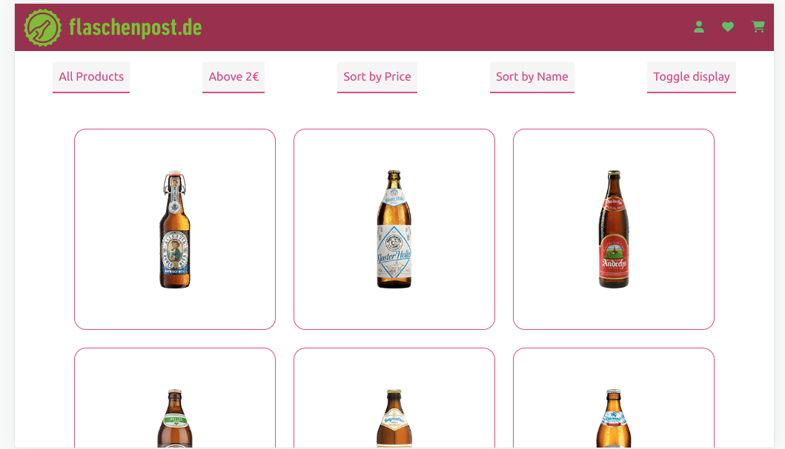

# FlaschenPost

This project was generated with [Angular CLI](https://github.com/angular/angular-cli) version 15.2.0.

Live Site URL: [https://harshita1225.github.io/flaschen-post-demo/](https://harshita1225.github.io/flaschen-post-demo/)

## Overview

### Project Specifications

- Create a Web-Site that acts both as a mobile and desktop optimized web-page to display products

- between two different styles of views as seen in the mocks below via a button at
  the top bar

- offers a button to sort the result by price and toggle ascending and descending order.

- offers a toggle button to filter out beers which are more expensive than 2 euro per litre.

### Project Instructions

- npm i to install all packages
- ng serve -o (run script)

### Screenshot

### DESKTOP VERSION DETAIL VIEW

### TABLET VERSION DETAIL VIEW

### MOBILE VERSION DETAIL VIEW

### DESKTOP VERSION TOGGLE VIEW

## My process

- Nav Bar
- Card Container
- filer and sorting buttons

### Built with

- Semantic HTML5 markup
- Typescript
- Angular CLI
- sCSS
