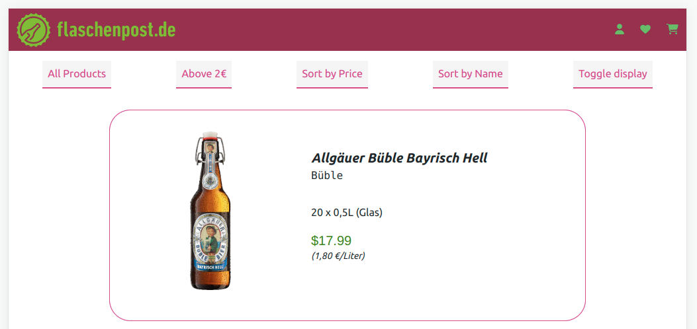
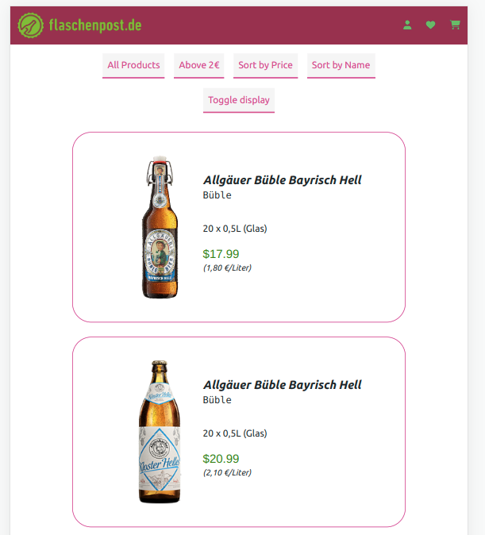
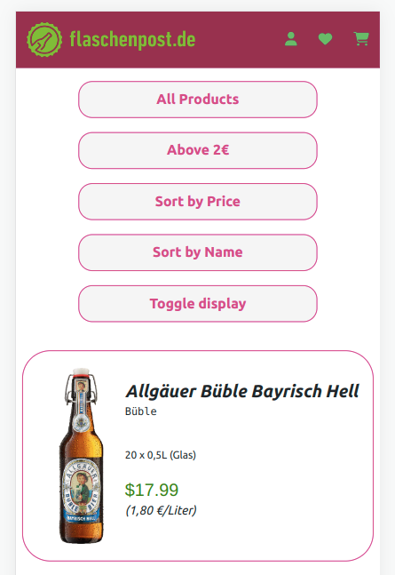

# FlaschenPost

This project was generated with [Angular CLI](https://github.com/angular/angular-cli) version 15.2.0.

## Overview

### Project Specifications

- Create a Web-Site that acts both as a mobile and desktop optimized web-page to display products

- between two different styles of views as seen in the mocks below via a button at
  the top bar

- offers a button to sort the result by price and toggle ascending and descending order.

- offers a toggle button to filter out beers which are more expensive than 2 euro per litre.

### Screenshot

#### Desktop Version

- HomePage
  

- Home Page
  
- Home Page
  

## My process

- Home Page
- Login Page
- Movie Info Page
- Seat Selection Page
- Date Time Selection Page
- Booking History
  -Food Offers Page
- Confirmation Page

### Built with

- Semantic HTML5 markup
- Typescript
- Angular CLI
- sCSS
